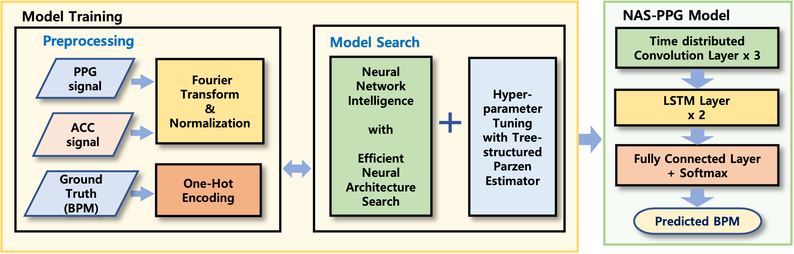
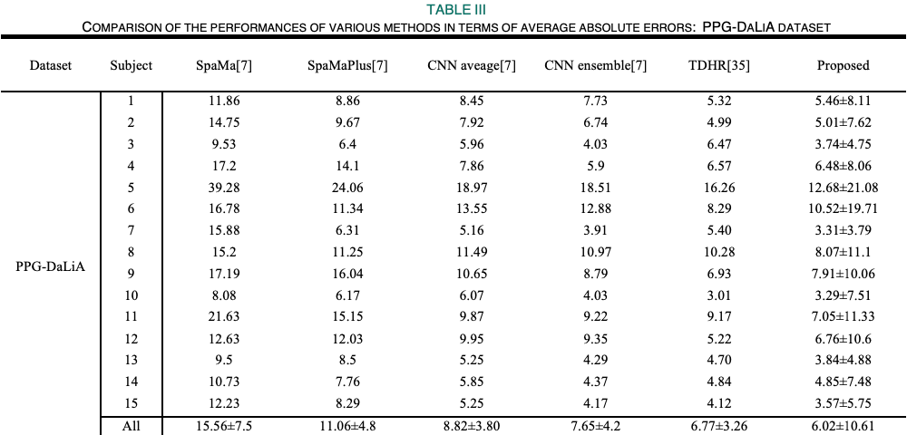
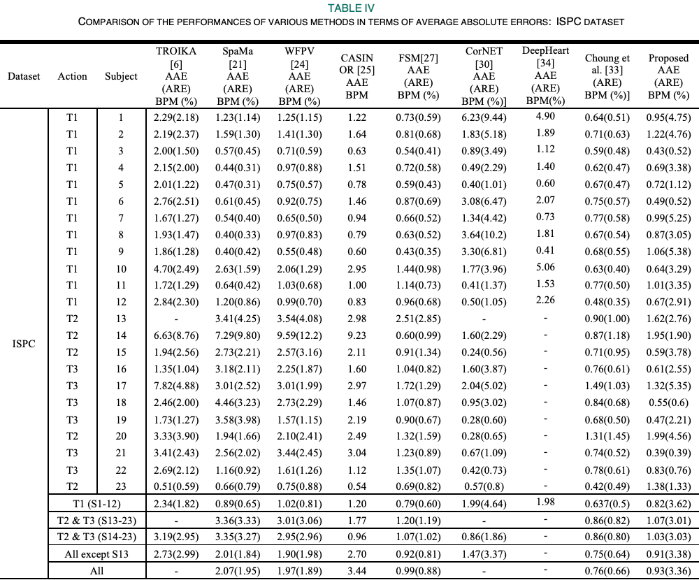

# NAS-PPG




This repository contains the primordial TensorFlow implementation of the following paper:

> **NAS-PPG: PPG-Based Heart Rate Estimation Using Neural Architecture Search**
>
> Seok Bin Song; Jung Woo Nam; Jin Heon Kim
> 
> https://ieeexplore.ieee.org/document/9402889
> 
> **Abstract:** *It is common for people to use wristband-type electronic devices such as smartwatches for routine healthcare services. Among the healthcare services provided by smartwatches, the method of measuring the heart rate (HR) during exercise is non-invasive and uses a photoplethysmogram (PPG); however, the disadvantage is that it is vulnerable to the motion artifacts (MAs) of the user. A technique for removing an MA from a PPG by using an accelerometer was studied and recently many studies were conducted based on deep learning-based algorithms. In this study, various preprocessing techniques were compared, and optimal preprocessing parameters were determined, and an improvement in the performance was achieved by using a model tuning technique. In addition, the model was optimized with hyperparameter search and neural architecture search using Neural Network Intelligence developed by Microsoft. As a result, the parameter was reduced by 75 times as compared to previous works, and the mean absolute error (MAE) was improved by 26%, from 7.65 BPM to 6.02 BPM.*

**Note:** *This repository doesn't provide the code related to NNI framework. It only presents the baseline implementation of the model, data preprocessing, and model benchmark methods.*

## Benchmark




## Citation

```text
@article{song_nam_kim_2021,
  title   = {NAS-PPG: PPG-Based Heart Rate Estimation Using Neural Architecture Search},
  volume  = {21},
  DOI     = {10.1109/jsen.2021.3073047},
  number  = {13},
  journal = {IEEE Sensors Journal},
  author  = {Seok Bin Song and Jung Woo Nam and Jin Heon Kim},
  year    = {2021},
  pages   = {14941–14949}
} 
```